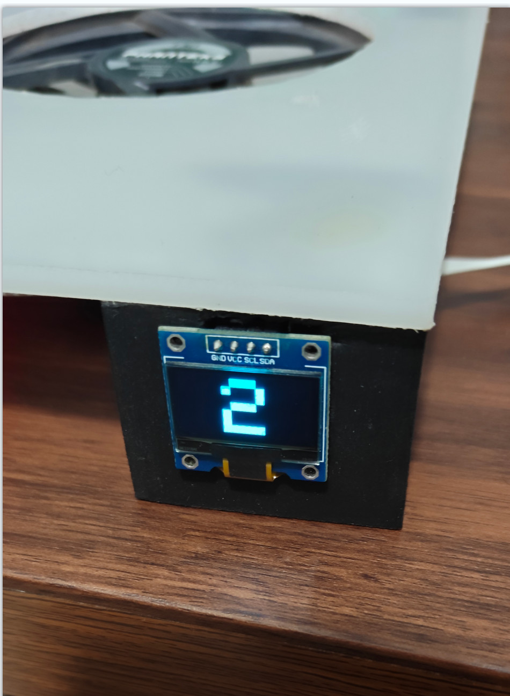

# ESP32 CPU/GPU 温控风扇

一个由 Windows 上位机与 ESP32 固件组成的电脑散热风扇控制项目。上位机读取 CPU/GPU 温度，经蓝牙串口发送给 ESP32；ESP32 根据工作模式和温度调整 PWM 风扇转速，并在 OLED 上显示状态。



## 功能

- 读取 CPU 与 NVIDIA/AMD/Intel GPU 温度
- 通过蓝牙串口向 ESP32 发送 `CPUxx.x`、`GPUxx.x` 数据
- 自动寻找、断线重连蓝牙串口，支持电脑休眠唤醒恢复
- Windows 托盘实时显示温度曲线和连接状态
- 安静、正常、高速、手动、自定义五种风扇模式
- 128×64 SSD1306 OLED 状态显示
- 按键调速、自定义温控曲线并保存到 EEPROM
- 无连接或长时间无数据时自动停止风扇并关闭屏幕

## 目录说明

| 文件 | 说明 |
| --- | --- |
| `sketch_nov9a2/sketch_nov9a2.ino` | ESP32 Arduino 固件 |
| `2.py` | Windows 上位机源码 |
| `CPU_fan.exe` | 已编译的 Windows 上位机 |
| `com.ini` | 串口及重连参数 |
| `LibreHardwareMonitorLib.dll` | 硬件温度读取库 |
| `HidSharp.dll` | LibreHardwareMonitor 依赖 |
| `Only.ico` | 上位机图标 |
| `fan-打包exe 配置文件/` | 已打包程序、DLL 与配置文件的完整可运行目录 |

## 快速使用

### 1. 烧录 ESP32

使用 Arduino IDE 打开 `sketch_nov9a2/sketch_nov9a2.ino`，安装以下库后编译烧录：

- Adafruit GFX Library
- Adafruit SSD1306
- ESP32 Arduino Core（提供 BluetoothSerial、EEPROM）

固件默认硬件连接：

- PWM 风扇控制：GPIO 5
- 五个按键：GPIO 12、13、14、15、16，使用 `INPUT_PULLDOWN`
- SSD1306 OLED：I²C 地址 `0x3C`，使用开发板默认 SDA/SCL
- 蓝牙设备名：`esp32散热器`

> 风扇电流通常超过 ESP32 GPIO 的驱动能力，请通过 MOSFET/驱动电路控制，并确保 ESP32 与风扇电源共地。

### 2. 配对蓝牙串口

在 Windows 蓝牙设置中与 `esp32散热器` 配对，随后在设备管理器中确认它对应的 COM 端口。

### 3. 运行上位机

下载或克隆本仓库，确保下面四个文件位于同一目录：

```text
CPU_fan.exe
com.ini
LibreHardwareMonitorLib.dll
HidSharp.dll
```

编辑 `com.ini`，将 `port` 改为实际端口，然后双击 `CPU_fan.exe`。程序在系统托盘运行；右键托盘图标可查看温度、连接状态或退出。

若希望自动寻找端口，可将 `port` 设为 `AUTO`。也可用 `target_hwid_contains` 或 `target_description_contains` 精确匹配目标设备。

## 配置说明

```ini
[SERIAL]
port = COM5
baudrate = 115200

[SETTINGS]
update_interval = 2.0
reconnect_interval = 3.0
wake_gap_seconds = 8.0
wake_recovery_seconds = 20.0
ack_timeout_seconds = 10.0
tray_update_interval = 1.5
history_size = 30

[DISCOVERY]
port_scan_keywords = bluetooth,蓝牙,bthenum
target_hwid_contains =
target_description_contains =
```

## 从源码运行

建议使用 64 位 Python 3.11 或 3.12：

```powershell
python -m venv .venv
.\.venv\Scripts\Activate.ps1
python -m pip install -r requirements.txt
python .\2.py
```

两个 DLL 需要与 `2.py` 位于同一目录。

## 编译 EXE

```powershell
python -m pip install -r requirements-build.txt
pyinstaller --noconfirm --clean --onefile --windowed --name CPU_fan --icon Only.ico --add-binary "LibreHardwareMonitorLib.dll;." --add-binary "HidSharp.dll;." 2.py
```

编译结果位于 `dist/CPU_fan.exe`。发布时请同时提供 `com.ini`；仓库根目录已经附带可直接使用的编译版本。

## 通信协议

上位机按行发送 ASCII 文本：

```text
CPU52.3
GPU47.8
```

ESP32 收到有效数据后回复 `ACK`。默认串口速率为 115200。

## 注意事项

- 目前仅支持 Windows；温度数据由 LibreHardwareMonitor 获取。
- 某些硬件传感器可能需要管理员权限才能读取。
- Windows 或杀毒软件可能会对未签名的 PyInstaller 程序报警，请自行核对源码后运行。
- 高温控制属于辅助散热方案，请勿以本项目替代主板自身的过热保护。
